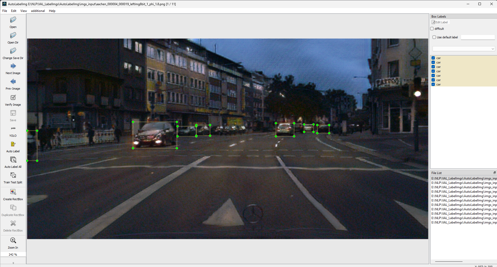

[English](README.md) | [简体中文](VAL_LabelImgs/readme/README.zh-CN.md) | [Tiếng việt](VAL_LabelImgs/readme/README.vietnam-vn.md)
# VAL LabelImg

This is a tool used for labeling based on LabelImg, primarily designed for Object Detection labeling. This tool introduces several new features, such as the integration of AutoLabelImg with backbones based on the latest algorithms like YOLOv8, YOLOv9, YOLOv10, and RT-DETR, enabling labeling of thousands of images in a very short time. The project was developed by Tien-Dat Nguyen, a member of the Vision and Learning Lab at Hung Yen University of Technology and Education.

## Contents
1. [Introduction](#introduction)
2. [Timeline](#timeline)
3. [Installation](#installation)
4. [Quick Start Overview](#quick-start-overview)
5. [Send Us Feedback!](#send-us-feedback)
6. [License](#license)


# Introduction
By using YOLO and RT-DETR Latest, we can label thousands of images in a very short time. This tool is designed to be user-friendly and easy to use, with a simple interface that allows users to label images quickly and efficiently. The tool is also equipped with a variety of features that make it easy to use, such as the ability to label multiple objects in a single image, the ability to label objects with different shapes and sizes, and the ability to label objects with different colors. Besides, we can use custom classes from our weights.

<p align="center">
    
</p>

The UI of VAL-AutoLabelImg is similar to [LabelImg](https://github.com/HumanSignal/labelImg)
You can see our video demo as:
<p align="center">
    
    <br>
    <sup>Demo VAL-AutoLabelImg <a href="https://github.com/ultralytics/ultralytics" target="_blank"><i>on Yolov8</i></a></sup>
</p>

# Timeline
- [Sep 18 2024] VAL-AutoLabelImg allows the use of custom weights with a custom YAML file.
- [Sep 17 2024] We publish the Docker image on [Docker Hub.](https://hub.docker.com/r/nguyendat1354/val-autolabel)
- [Sep 15 2024] We add RT-DETR with VAL-AutoLabelImg.
- [Sep 13 2024] We add AutoLabelImg with [YoloV9](https://github.com/WongKinYiu/yolov9)and [YoloV10](https://github.com/THU-MIG/yolov10).
- [Sep 12 2024] We release the first version of VAL-AutoLabelImg, includes YOLOv8.
# Installation

### With Python Base ( Pip)
Requirements python >= 3.8
1. Install dependences library
 ```bash
pip install VAL-LabelImgs
```

### With Anaconda 
1. Install dependences library
   - You can load dependences library with ``` env.yaml``` file.
   - You can find ```env.yaml``` file in folder ```Conda```
2. After you install dependences library, you can run this command for PyQT build resources
```bash
pyrcc5 -o libs/resources.py resources.qrc
```

### With Docker
You can build docker images with my docker file.
1. Build docker images
In folder ```main``` of this project open command prompt and run
``` bash
docker build -t [names_you_choose] .
Example: docker build -t valautolabels .
```

### With Docker Hub
You can pull docker images from my docker hub

# Quick Start Overview
### With Python Base Environments and Anaconda Environment
1. Quick Run
- You can run this file ```autolabelImg.py``` to start this project.

2. Using with command line
- You can use this command to run this project
```bash
python mainapp.py
```

### With Docker
1. Quick Run
You access this project with this command
```bash
docker run -it \
--env DISPLAY=$DISPLAY \
--volume /tmp/.X11-unix:/tmp/.X11-unix \
--device /dev/snd \
your_image_name
```

# Send Us FeedBack
Our project is open source for research purposes, and we want to improve it! So let us know (create a new GitHub issue or pull request, email us, etc.) if you...
1. Find/fix any bug (in functionality or speed) or know how to speed up or improve any part of VAL-LabelImg.
2. Want to add/show some cool functionality/demo/project made on top of VAL-AutoLabelImg. We can add your project link to your [Issue](https://github.com/datnguyen-tien204/VAL_ImglabelImg/issues)

# License
This project is freely available for free non-commercial use. If it useful you can give 1 star. Thanks for using.
