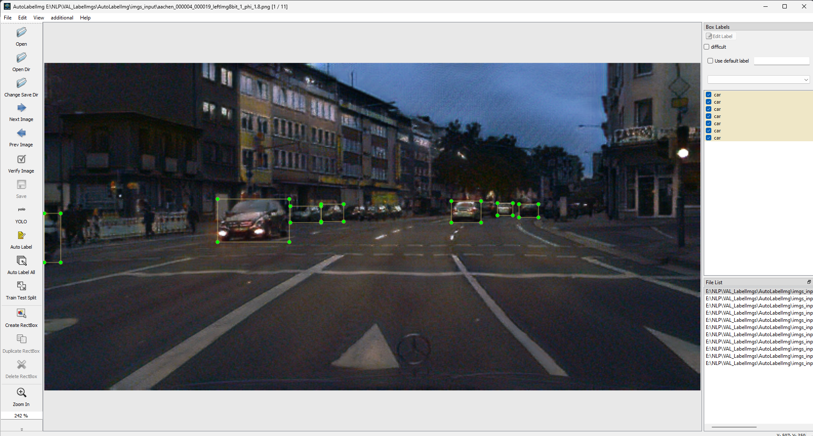

[English](../../README.md) | [简体中文](README.zh-CN.md) | [Tiếng việt](README.vietnam-vn.md)
# VAL LabelImg

这是一个基于LabelImg的标注工具， [LabelImg](https://github.com/HumanSignal/labelImg), 主要设计用于目标检测标注。该工具引入了一些新功能，例如集成了 AutoLabelImg 与基于最新算法的骨干网，如 YOLOv8、YOLOv9、YOLOv10 和 RT-DETR，能够在非常短的时间内标注数千张图像。该项目由 Tien-Dat Nguyen 开发，他是 Hưng Yên 工业与教育大学视觉与学习实验室的成员。
## Contents
1. [Introduction](#introduction)
2. [Timeline](#timeline)
3. [Installation](#installation)
4. [Quick Start Overview](#quick-start-overview)
5. [Send Us Feedback!](#send-us-feedback)
6. [License](#license)


# Introduction
通过使用最新的 YOLO 和 RT-DETR，我们可以在非常短的时间内标注数千张图像。该工具被设计为用户友好且易于使用，具有简单的界面，使用户能够快速有效地标注图像。该工具还配备了许多使其易于使用的功能，例如标注单张图像中的多个对象、标注不同形状和大小的对象，以及标注不同颜色的对象。此外，我们还可以使用您提供的权重中的自定义类别。
<p align="center">
    
</p>

VAL-AutoLabelImg 的界面与... 类似 [LabelImg](https://github.com/HumanSignal/labelImg)
您可以通过以下方式查看我们的演示视频：
<p align="center">
    
    <br>
    <sup>Demo VAL-AutoLabelImg <a href="https://github.com/ultralytics/ultralytics" target="_blank"><i>on Yolov8</i></a></sup>
</p>

# Timeline
- [2024年9月18日] VAL-AutoLabelImg 允许使用自定义权重和自定义 YAML 文件。
- [2024年9月17日] 我们在 Docker Hub 上发布了 Docker 镜像。 [Docker Hub.](https://hub.docker.com/r/nguyendat1354/val-autolabel)
- [2024年9月15日] 我们将 RT-DETR 添加到 VAL-AutoLabelImg 中。
- [2024年9月13日] 我们将 AutoLabelImg 添加到 [YoloV9](https://github.com/WongKinYiu/yolov9) "和" [YoloV10](https://github.com/THU-MIG/yolov10).
- [2024年9月12日] 我们发布了 VAL-AutoLabelImg 的第一个版本，包括 YOLOv8。
# Installation

### 与 Python Base
Requirements python >= 3.8
1. 安装依赖库
 ```bash
%cd VAL_ImglabelImg
pip install -r requirements.txt
pyrcc5 -o libs/resources.py resources.qrc
```

### 与 Anaconda 
1. 安装依赖库
   - 您可以通过以下方式加载依赖库： ``` env.yaml``` file.
   - 您可以在文件夹 ```env.yaml``` 中找到 ```Conda``` 文件
2. 在您安装了依赖库之后，您可以运行此命令来构建 PyQT 的资源。
```bash
pyrcc5 -o libs/resources.py resources.qrc
```

### 与 Docker
您可以使用我的 Docker 文件构建 Docker 镜像。
1. 构建 Docker 镜像
在此项目的  ``VAL_LabelImg``` 文件夹中，打开命令提示符并运行
``` bash
%cd VAL_LabelImg
docker build -t [names_you_choose] .
Example: docker build -t valautolabels .
```

### 与 Docker Hub
您可以从我的 Docker Hub 拉取 Docker 镜像。

# Quick Start Overview
### Với môi trường Python Base và môi trường Anaconda
1. 快速启动
- 您可以运行文件 ```autolabelImg.py``` 来启动项目。

2. 使用命令行
- 您可以使用以下命令行来运行项目：
```bash
%cd VAL_LabelImg
python mainapp.py
```

### With Docker
1. 快速启动
您可以通过以下命令访问该项目：
```bash
docker run -it \
--env DISPLAY=$DISPLAY \
--volume /tmp/.X11-unix:/tmp/.X11-unix \
--device /dev/snd \
your_image_name
```

# Send Us FeedBack
我们的项目是开源的，旨在研究目的，并且我们希望改进它！因此，如果您...
1. 发现或修复了任何错误，或者知道如何加速或改进 VAL-LabelImg 的任何部分，请告诉我们（创建 GitHub 问题或拉取请求，给我们发送电子邮件等）。
2. 想要添加/展示一些基于 VAL-AutoLabelImg 构建的有趣功能/演示/项目，我们可以将您的项目链接添加到 [Issue](https://github.com/datnguyen-tien204/VAL_ImglabelImg/issues)  中。

# License
该项目免费提供用于非商业用途。如果您觉得有用，可以给予 1 星评价。感谢您的使用。